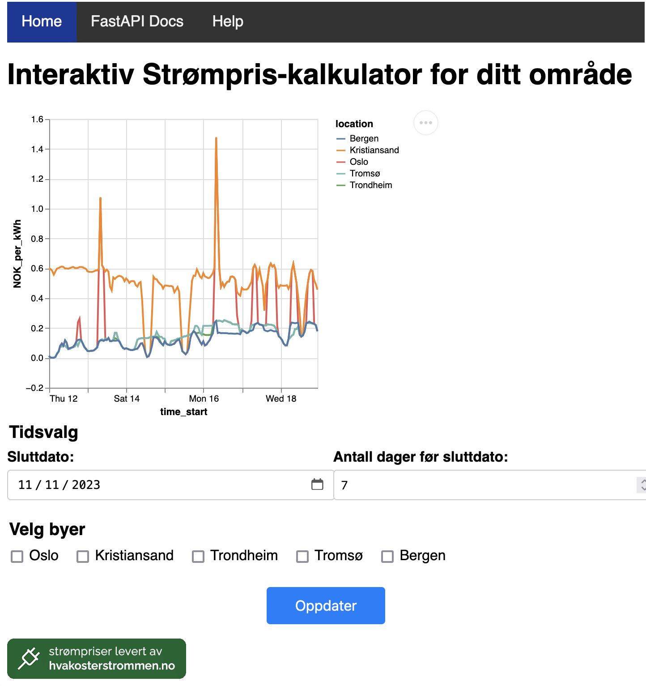

# Strømpris

This project is a web application that visualizes electricity prices using data from the Strømpris API. It includes a module strompris.py for fetching and processing the data, and app.py for running a FastAPI server with Uvicorn to serve the web interface. The web application displays a chart created with Altair and offers user input fields to modify chart parameters. Additionally, the project includes documentation generated with FastAPI and Sphinx.




## Dependencies
This project requires Python 3.8 or later. The following packages are necessary to run the application:

FastAPI
Uvicorn
Requests
Requests-cache
Pandas
Altair


## Installation

1. First, clone the repository to your local machine using git:
```
git clone https://github.uio.no/IN3110/IN3110-stefansp.git
cd assignment5
```
Install the dependencies with pip:
```
pip install .
```
This will install all the necessary Python packages in their correct versions.
(If that doesn't work, try replacing pip with pip3.)


## Running the Application
To run the application, navigate to the project directory and execute the following command:

```
python3 app.py
```

Alternatively: 
```
uvicorn app:app --host 127.0.0.1 --port 5000 --reload
```
This will start the FastAPI server on localhost at port 5000. 
You can access the web-app by going to `http://127.0.0.1:5000` in your browser.
It might take a few seconds for Uvicorn to get it running. 


## Interacting with the Web Application
Once the application is running, you will see a chart displaying electricity prices. You can modify the parameters of the chart using the input fields provided below it. This includes changing the starting date, date range, and selecting different locations.


## Documentation
The project includes two sets of documentation:

FastAPI Documentation: Automatically generated and can be accessed at `http://127.0.0.1:5000/docs`.
Sphinx Documentation: Located in the docs directory and can be accessed at `http://127.0.0.1:5000/help`.

Both documentations are accesible from the navigation bar on top of the website. 

### Disclaimer
This project was made in relation to a course at the University of Oslo
